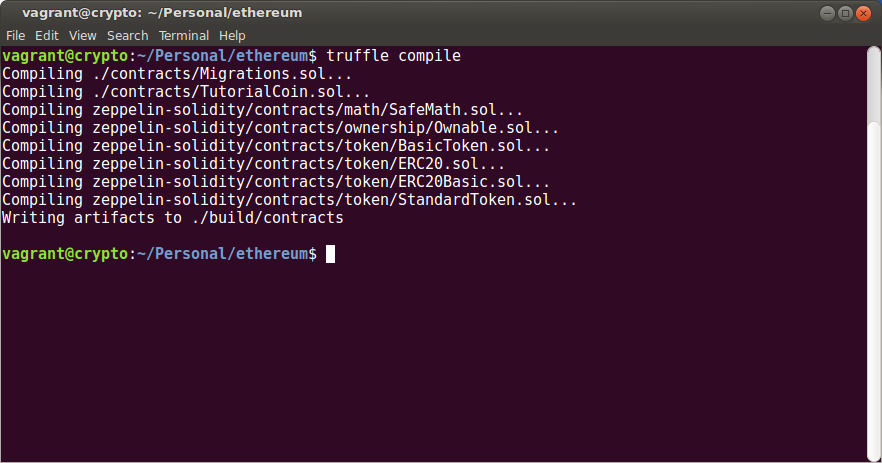

The TutorialCoin Token
======================

For this tutorial we have created a smart contract for a token which can
be traded on the blockchain.  It has a few necessary attributes.

Token Attributes
----------------

ERC20 Compliance
................

`ERC20 <https://theethereum.wiki/w/index.php/ERC20_Token_Standard>`__ is the
so-called "token standard interface." By creating a token that adheres to
this standard other software that conforms to the standard will be able to
interact with it.

The standard itself defines a few functions that must be implemented:

.. code::

    contract ERC20 {
          function totalSupply() constant returns (uint totalSupply);
          function balanceOf(address owner) constant returns (uint balance);
          function transfer(address to, uint value) returns (bool success);
          function transferFrom(address from, address to, uint value) returns (bool success);
          function approve(address spender, uint value) returns (bool success);
          function allowance(address owner, address spender) constant returns (uint remaining);
          event Transfer(address indexed from, address indexed to, uint value);
          event Approval(address indexed owner, address indexed spender, uint value);
    }

There are six functions and two events defined in the standard:

* ``totalSupply()``: Returns the total supply of the token
* ``balanceOf()``: Returns an addresses balance.
* ``transfer()``: Transfer a token from one address to another.
* ``transferFrom()``: A third-party transfer (an account transfers) tokens
  between two other addresses.
* ``approve()``: : The function used to approve a third-party transfer via
  ``transferFrom()``.
* ``allowance()``: Returns the approved limit for third-party transfers.

There are also two events defined:

* ``Transfer``
* ``Approval``

Additionally, there are a few data items defined in the standard:

.. code::

  string public constant name = "Token Name";
  string public constant symbol = "SYM";
  uint8 public constant decimals = 18;  // 18 is the most common

(Solidity does not do floating point, so ``decimals`` is used for that purpose.
When set to 18, for example, the balances will be divided by 10^18 to convert.)

Ownable
.......

The contract will be ownable. In other words, there will be an owner's address,
and this address will be able to do things that other addresses cannot do.
Specifically....

Minting New Tokens
..................

For this tutorial we will allow the owner of the contract to mint tokens.

Sometimes token contracts are creates with a cap, so that all tokens are
created at the time of instantiation. Here, though, we'll allow the tokens
to be minted at any time.

Open Zeppelin
-------------

The main attributes that we've defined -- ERC20 compliance and ownability -- are
fairly common, and as such the Open Zeppelin framework already contains
code for that use. Therefore creating our token should be simple; we should be
able to glue a few pieces of code together to get our functionality.

We'll start with ownability.

Ownability
..........

Open Zeppelin contains an ownable contract, ``contracts/ownership/Ownable.sol``
which is pretty straight-forward and provides the owbability we need. It is simple,
so we can include it here in its entirety (with the source comments removed
for brevity).

.. code:: javascript

  pragma solidity ^0.4.11;

  contract Ownable {
    address public owner;

    event OwnershipTransferred(address indexed previousOwner, address indexed newOwner);

    function Ownable() {
      owner = msg.sender;
    }

    modifier onlyOwner() {
      require(msg.sender == owner);
      _;
    }

    function transferOwnership(address newOwner) onlyOwner public {
      require(newOwner != address(0));
      OwnershipTransferred(owner, newOwner);
      owner = newOwner;
    }

  }

(You can see the current version, with comments, on GitHub `here <https://github.com/OpenZeppelin/zeppelin-solidity/blob/master/contracts/ownership/Ownable.sol>`__).
By deriving your contract from ``Ownable``, you are adding one data item (``owner``),
one modifier (``onlyOwner``), one function (``transferOwnership``), and one
event (``OwnershipTransferred``).

Thus, you would expect to find something like:

.. code:: javascrript

  contract TutoritalCoin is Ownable, ... {
  ...
  }

in the code base (and you do).

ERC20
.....

Open Zeppelin also includes ERC20 compliance. It include an interface
(``ERC20Basic.sol``) and implementation (``BasicToken.sol``) for a simplified
API (which does not include third-party transfers), as well as an interface
(``ERC20.sol``) and implementation (``StandardToken.sol``) which includes
full ERC20 compliance. Since we want full cimpliance, we'll derive our
token fro ``StandardToken.sol``.

(The standard token actually includes some additional functionality, allowing
third-part allowances to be increased and decreased, but we'll not really say
much about that in this tutorial.)

Mintable
........

We'll want to apply the ``onlyOwner`` modifier to our mintable function, which
we'll write ourselves.

Math
....

One last thing: The Open Zeppelin framework contains a ``SafeMath`` library
that we'll use. If you've looked at much Solidity code on-line, you'll notice that
the common pattern is to check for overflows and underflows at the time of
computation. The SafeMath library is intended to do this for you in a reliable
way.

The Contract Proper
-------------------

Given the functionality that Open Zeppelin provides, the actual code for
the contract is pretty straight-forward.

* Include the StandardTOken and Ownable interface/implementation.
* Set our data items (name, symbol, decimals).
* Create a ``mintTokens()`` function that only the owner of the contract
  can execute.

With that in mind, this is the contract in its entirety:

.. code:: javascript

  /**
   * Copyright (C) 2017, Mark Conway Wirt
   * Distributed under an MIT-style license. See
   * LICENSE.txt for details.
   */

  pragma solidity ^0.4.13;

  import 'zeppelin-solidity/contracts/ownership/Ownable.sol';
  import 'zeppelin-solidity/contracts/token/StandardToken.sol';
  import 'zeppelin-solidity/contracts/math/SafeMath.sol';

  /**
   * @title Standard ERC20 Token for Tutorial
   *
   * @dev This is an implementation of an ERC20 compliant token.
   */
  contract TutorialCoin is Ownable, StandardToken {
    using SafeMath for uint256;

    // Expected of ERC20
    string public constant name     = "TutorialCoin";
    string public constant symbol   = "TUT";
    uint8  public constant decimals = 18;

    function TutorialCoin () {
    }

    function mintTokens (uint256 _value) onlyOwner {
      balances[msg.sender] = balances[msg.sender].add(_value);
      Transfer(0x0, owner, _value);
      totalSupply = totalSupply + _value;

    }
  }

Note the line:

.. code:: javascript

  balances[msg.sender] = balances[msg.sender].add(_value);

This is eqivalent to

.. code:: javascript

  balances[msg.sender] = balances[msg.sender] + _value;

but using the SafeMath library to avoid overflows.

Compiling the Code
------------------

To compile the code, use the ``truffle compile`` command. If everything
goes well, the TutorialCoin (along with its dependencies) will be compiled:

Next
----

* `Testing the code <../testing>`__.
