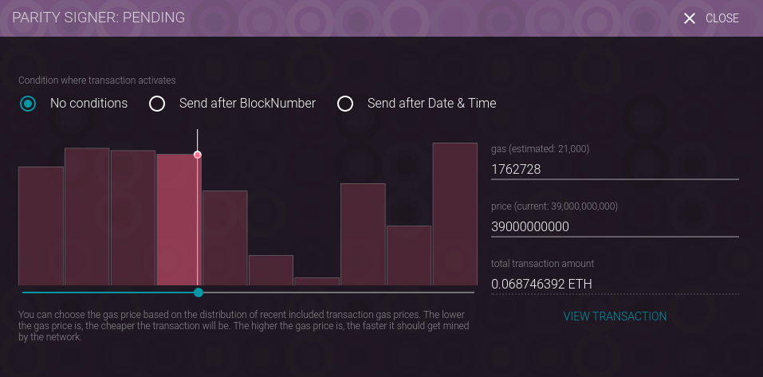

Deploying to a Public Network
=============================

Note: it is assumed that you have already installed parity and have synchronized to
the ethereum test network as described in the `software <../software>`__ section of
the tutorial. Additionally, you should have already gotten some test ether as described
there.

Second note: When you first install parity, it does not display the ``Contracts``
tab, which we will be using here. You'll want to enable that
under Settings->Views, as in the below:

Compiling the Code
------------------

Once you have working, tested, debugged code you'll want to deploy it to the testing
network. But first you'll need to compile it. There are several ways of doing this, but
for this tutorial we'll use the ``solc`` compiler. (Notes for compiling with
``solcjs`` are below.)

Support of import statements is a little fragile in the Solidity compilers. Truffle
expects a certain convention (and the code in this tutorial follows that convention),
but ``solc`` and/or ``solcjs`` don't necessarily follow it by default.

There are two ways that we can compile our contact successfully with the
Open Zeppelin dependencies: we can copy the contract to the ``node_modules``
directory and compile from there, or we can specify where the Zeppelin files
are on the command line.

For the first way, we'll:

* Copy the source code to the ``node_modules`` directory.
* Use the ``solc`` compiler
* Create a combined ABI/bin file for deployment.

Assuming that we're in the ``node_modules`` directory:

.. code:: bash

  cp ../contracts/TutorialCoin.sol .
  solc -o . --combined-json bin,abi TutorialCoin.sol

will create a file, ``combined.json`` that can be used to deploy the contract. This file
contains both the application binary interface and the byte code in a format that
parity will understand.

Secondly, we can compile directly from the ``contract`` directory, but if we
do that we'll need to tell the compiler where to find our dependencies, and
we'll have to use *absolute* paths to do so (relative paths are not understood).
So to compile as in the above, but without copying the code, in my particular
environment I can do it with:

.. code:: bash

  solc -o . \
    --combined-json bin,abi \
    zeppelin-solidity=/home/vagrant/Personal/ethereum/node_modules/zeppelin-solidity \
    TutorialCoin.sol

You will need to use the path that is correct for your environment.

Once you have produced the combined JSON file (by either means) you will need to
input it into the parity interface.

If you go to Contracts-> Deploy you'll be met with a screen in which you can paste the
contents of ``combined.json`` and provide a few values for the deployment.

A few things to note:

* The output of ``solc`` was pasted into the combined-output/ABI box. Parity automatically
  broke the binary out and placed in the correct place.
* When using the combined output make sure to choose the correct contract under
  "Select a contract". All of the dependencies will also be listed there. Make sure to
  choose the correct, top-level contract (in this case
  ``TutorialCoin.sol:TutorialCoin``).

After you choose ``create`` you will be taken to a screen to approve the deployment from the
account that was specified. After you've done this, in a few minutes (or seconds)
the contract should be deployed. Upon success the contract should show up on the
contracts page:

You can also see it in a public blockchain explorer, such as the one at
`Ethscan <https://ropsten.etherscan.io/>`__. By searching on the contract's
deployment address, you can see the activity associate with the contract:

**If for some reason the deployment fails:** you will probably have to up the gas limit
on the transaction. For a first time deployment parity may default to 21,000 gas, which
may or may not be enough. When deploying a contract one can chose "Edit Conditions/Gas/Gas
Price" from the confirmation screen an adjust the gas used for the transaction:

After viewing or editing you can choose "View Transaction" and continue the deployment.

Compiling with ``solcjs``
-------------------------

If you didn't install the ``solc`` compiler, you'll need to use ``solcjs`` (which was
installed along with the Node.js modules), and you will need to compile the ABI and the
byte code into separate files. What's more, ``solcjs`` doesn't (currently) understand the
``import`` statements in the code, so you'll need to specify all the source files.
The following command:

.. code:: bash

  solcjs --bin --abi \
    TutorialCoin.sol \
    zeppelin-solidity/contracts/ownership/Ownable.sol \
    zeppelin-solidity/contracts/token/StandardToken.sol \
    zeppelin-solidity/contracts/math/SafeMath.sol \
    zeppelin-solidity/contracts/token/ERC20.sol \
    zeppelin-solidity/contracts/token/BasicToken.sol  \
    zeppelin-solidity/contracts/token/ERC20Basic.sol

will create ``bin`` and ``abi`` files for the deployment.

Next
----

* `Interacting <../interact>`__ with the contract.
