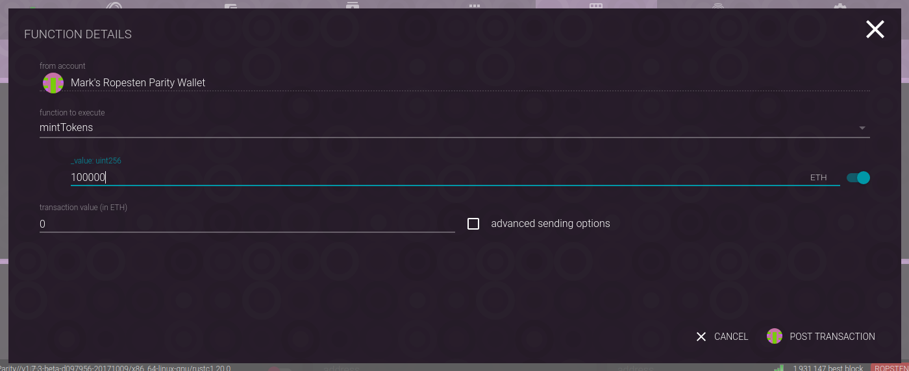
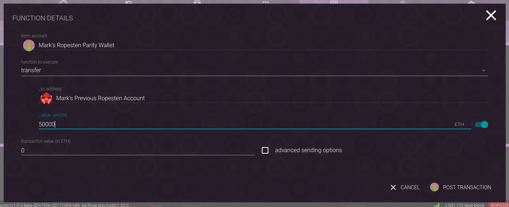
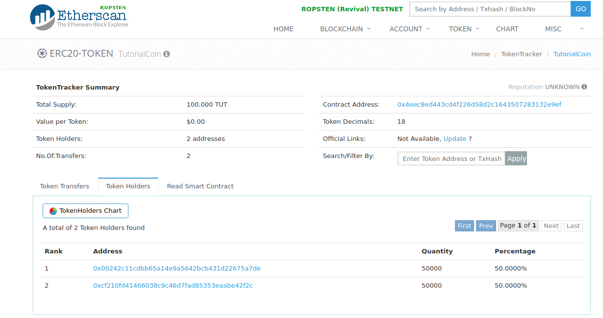

Interacting with a Smart Contract
=================================

To interact with a smart contract, one needs the contract's address and
its `Application Binary Interface <https://solidity.readthedocs.io/en/develop/abi-spec.html>`__,
which is a machine-parsable document that describes the interface into the contract. As you
deployed the contract yourself via parity you already have those. If you were to share the
contract with other, you would need to share those data items.

(When we deployed the contract we did so via a combined ABI/bytecode file. If you want to
share the ABI, it would probably be easiest to compile the ABI directly:

.. code::

  solc -o . --abi TutorialCoin.sol

will create an ABI file for each contract in the source file, or referenced in the
source file. In this case one would share ``TutoeialCoin.abi``, along with the
address of the deployed contract.)

For this tutorial, we'll mint 100,000 coins and transfer 50,000 of them to
a different address. But first:

Understanding ``decimals``
..........................

Remember that the TutoritalCoin contract contains the following:

.. code:: javascript

  string public constant name     = "TutoritalCoin";
  string public constant symbol   = "TUT";
  uint8  public constant decimals = 18;

Recall that solidity does integer math natively, not floating point. The 18 here means
that the balances carried are really 1*10^-18 tokes, so to have one token, one would
need a balance of:

.. code::

  1,000,000,000,000,000,000

which is a *big* number. But remember the ERC20 standard?

.. code::

  string public constant name = "Token Name";
  string public constant symbol = "SYM";
  uint8 public constant decimals = 18;  // 18 is the most common

18 is the most common decimal value because it is also the decimal conversion between
ether and ``wei``, which are the units that are used internally to store ether on
the blockchain. If one were to transfer 1 ether to a contract, one would in fact be
transfering 1,000,000,000,000,000,000 wei.

Because of this the parity interface has the ability to "multiply by 10^18"
automatically. Number inputs have a slider associated with them, and by setting it to
"``eth``" it will do the multiplication for you.

By choosing the contract then choosing "execute" one can execute any of the public
functions in the contract. Because we're the owner, we can call the ``mintTokens`` function.

(note the ``_value`` variable is set to ``eth``. If it were not the value would have to
have 18 more zeros appended to it).

After we've minted the tokens, we'll use the ``transfer`` function to transfer 50,000
of them to a different address:

Seeing the Tokens Publicly
--------------------------

The blockchain explorer at ropsten.ethscan.io will allow you to see the activity
of any address or contract. Additionally, it too understands the ERC20 standard, to
you can search fro token activity. One can go to the `token search page <https://ropsten.etherscan.io/token-search>`__ and
search for ``TutorialCoin``, you can see all of the activity, including who owns the
tokens:

As you can see in the above, there are 100,000 tokens, 50,000 of which are owned by
each of two separate accounts.

(Note that as you work through this tutorial you can change the name to make it
easier to find the coin, but you can also find it from the contract address. You can
play around with the blockchain explorer to see what's possible.)

Next
----

* `Publishing <../publish>`__ source code.
