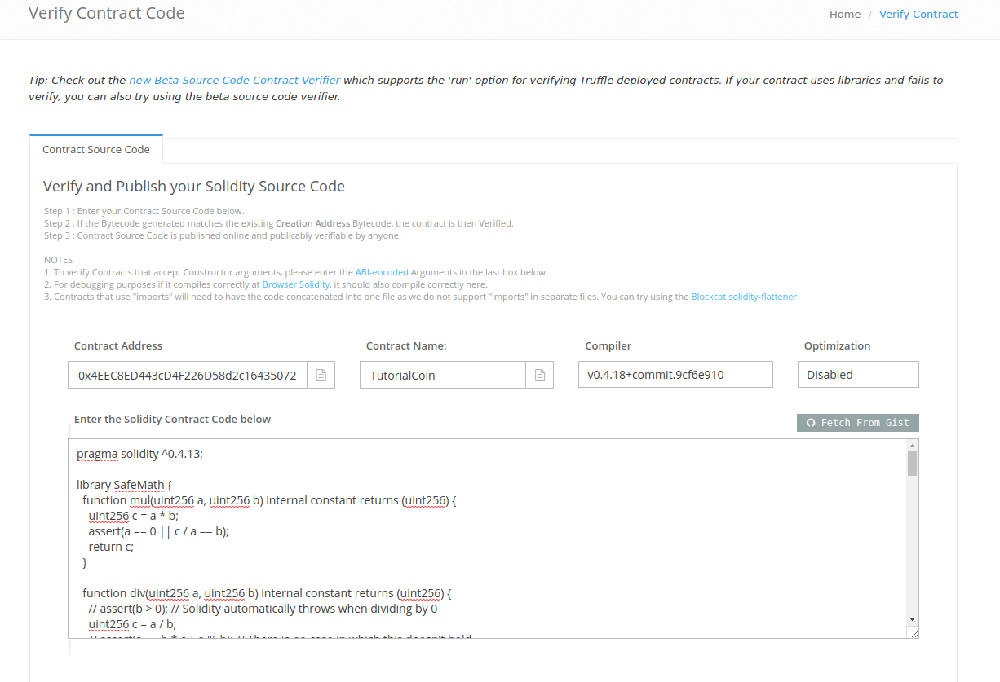
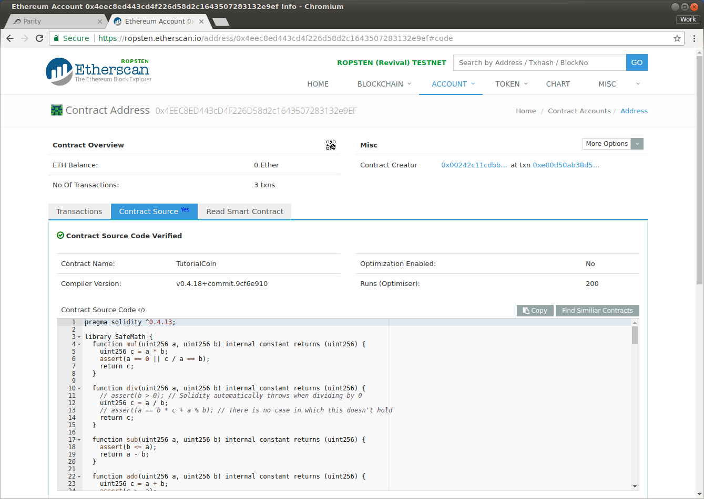

Publishing Source Code
======================

One of the strengths of blockchain technology -- perhaps *the*
strength -- is its transparency. As such, it is common to make source code
available for people's inspection. Additionally, it is possible to associate
source code with the binary of a specific contract.

(What is described on this page needs the ``solc`` compiler installed, along with
``solidity_flatener``. ``solcjs`` will not work, so if you didn't install those you
can skip this part.)

To do this you will need to know a few things:

* The current version of ``solc``.
* The optimization settings for the contract you published.
* A source file that contains all of the dependencies in one file.

The version can be had easily from the command line:

.. code:: bash

  vagrant@crypto:~/Personal/ethereum$ solc --version
  solc, the solidity compiler commandline interface
  Version: 0.4.18+commit.9cf6e910.Linux.g++

So in our case it is "0.4.18+commit.9cf6e910".

If you compiled the code with the commands given in this documentation, you compiled it
without optimization.

Lastly, you can create the combined file with the ``solidity_flattener``::

  solidity_flattener --output combined.sol TutorialCoin.sol

will create a file, ``combined.sol``, which has all of source code we need.
(As in previous sections, this command should be run from the ``node_modules``
directory after the code has been copied there.)

Navigate to your contract by going to the blockchain explorer and searching on the
contract's address. Then choose the "Contract Code" tab, and then chose the
"Verify and Publish" link. This will take you to a screen where you can now
input the data that you've collected.

If everything went well, when you hit the "Verify and Publish" button you
should receive a success notification. After this happens everyone who is interested
can go to the contract's address on the explorer and view the code associate with the
contract:

Next Steps
----------

This tutorial was intentionally brief, as it was intended to bring you up and developing
as quickly as possible. Additional sources of information:

* To learn the ins and outs of Solidity, see the `on-line documentation <https://solidity.readthedocs.io/en/develop/>`__.
* To learn more about the truffle framework, start `here <http://truffleframework.com/docs/>`__.
* To learn more about Open Zeppelin, see their site at
  `read the docs <http://zeppelin-solidity.readthedocs.io/en/latest/index.html>`__.
