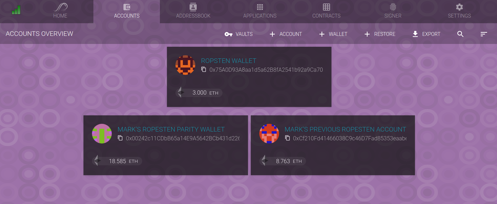

Installing the Software
=======================

There is some software that you will need to install:

* The main development node/javascript packages
* The parity ethereum client
* The ``solc`` compiler
* A Solidity flattener (optional).

Javascript Packages
-------------------

The core software components can be installed simply through ``npm``:

.. code:: bash

  npm install

This will install several packages, including:

* `web3 <https://github.com/ethereum/web3.js/>`__. This is the main ethereum
  javascript library. It provides an API into the ethereum blockchain. Most
  tools use this at their base.
* `Truffle <http://truffleframework.com/>`__. A development/testing framework for
  smart contract development.
* `testrpc <https://github.com/ethereumjs/testrpc>`__. ``testrpc`` is a node-based
  testing and development library for ethereum. With it you can test and deploy
  code on your local machine, which drastically reduces the time for
  iteration cycles, as compared to deploying to one of the public testing
  networks, such as `ropsten <https://ropsten.etherscan.io/>`__.
* `Open Zeppelin <https://openzeppelin.org/>`__, a "framework of reusable and
  secure smart contracts in the Solidity language."

The Open Zeppelin project is an ambitious project meant to bring reliable
components to the development of smart contracts -- kind of like a
`boost <http://www.boost.org/>`__ for solidity. It's still early in its
life-cycle, but its initial appearance is promising. The example in this
tutorial will be based upon that framework.

The above command (``npm install``) will install the software locally, so you
will not need root or ``sudo`` access, but you will need to add the installed
scripts to your path, such as:

.. code:: bash

  npm install
  cd node_modules/.bin
  export PATH=`pwd`:$PATH

(and adding the path to any terminal in which  you're developing).

Parity
------

Once the `parity <https://parity.io/>`__ client is installed, you'll want to
download the testing blockchain. In it's most basic terms, this can be done
with the command:

.. code:: bash

  parity --chain ropsten

This will download the blockchain, which could take a little while depending
upon the speed of your connection, the speed of your hard disk, etc. Note,
however, they parity client will conflict with the ``testrpc`` client (they
default to the same port), so it's probably a good idea to get in
the habit of using the ``--ports-shift``
keyword, which will shift all the ports the client listens on, including its
main port (8545 -> 8546), as well as the port the GUI listens on (8180 -> 8181).

.. code:: bash

  parity --chain ropsten --ports-shift 1

After you've started the client you can access the GUI through a web browser:

.. code:: bash

  http://localhost:8180/ # The default
  http://localhost:8181/ # with --ports-shift 1

The first time though you will be guided through the process of setting up
an account on the blockchain. Of course, you can have an many accounts and/or
wallets as you want, and you'll probably want at least two for testing purposes.
For example, this client shows two accounts and one multi-signature wallet:

Once you've synchronized the blockchain and created an account, you'll need
some ether to work on it. On the production chain ether is acquired through
mining or purchase; on the test networks there are "drips" or "faucets" that
will transfer some ether to your account. Currently the faucet at
http://faucet.ropsten.be:3001/ will transfer 3 ropsten ether to an account
you specify. I think there are daily limits, but 3 ether is plenty for doing
a little work on the public chain.

The ``solc`` Solidity compiler
------------------------------

As mentioned in the repository README, it is useful to install The
``solc`` compiler, although it is not strictly necessary as the ``solcjs`` version
installed with the node modules will work for development.

Information for installing the compiler (should you decide to do so)
can be found `here <http://solidity.readthedocs.io/en/develop/installing-solidity.html>`__.

The ``solidity_flattener``
--------------------------

You can also install the `solidity flattener <https://github.com/BlockCatIO/solidity-flattener>`__
if you have python installed::

  pip install solidity_flattener

This, along with ``solc`` can be used to publish source code in a way that
allows it to be associated with the contract code that is deployed on
the blockchain.

An Editor
---------

You'll want to deck out your favorite editor for solidity. The
`atom editor <https://atom.io/>`__ seems have reasonable Solidity support with
the appropriate plugins (but is a little buggy, in that the plugins sometime
crash).

Next
----

* `Creating a Project <../creating>`__.
