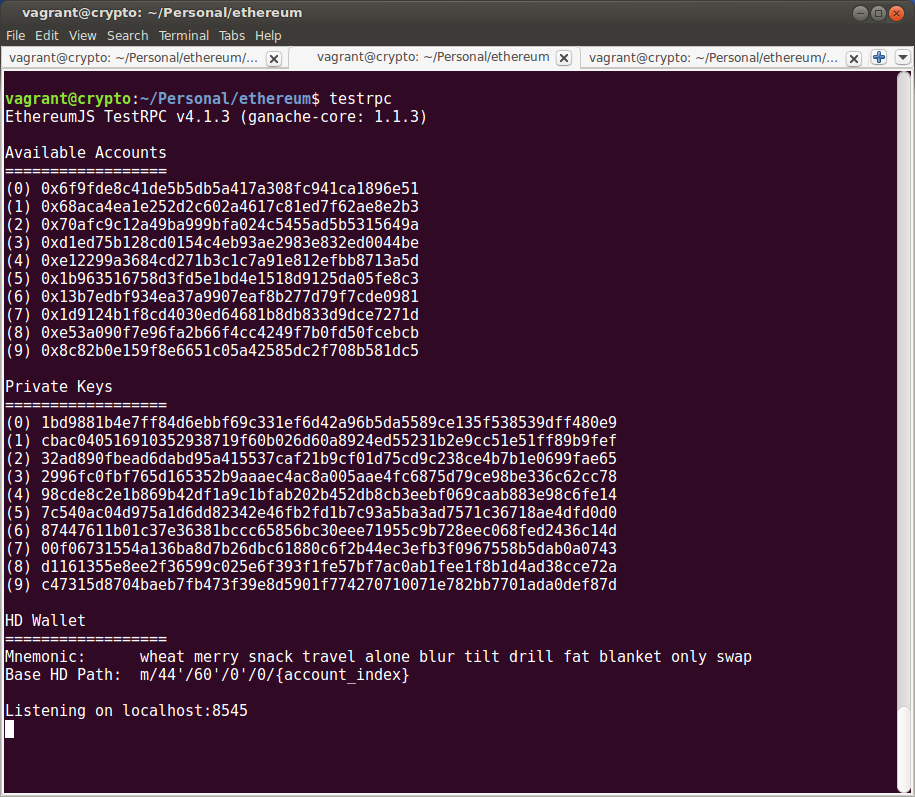
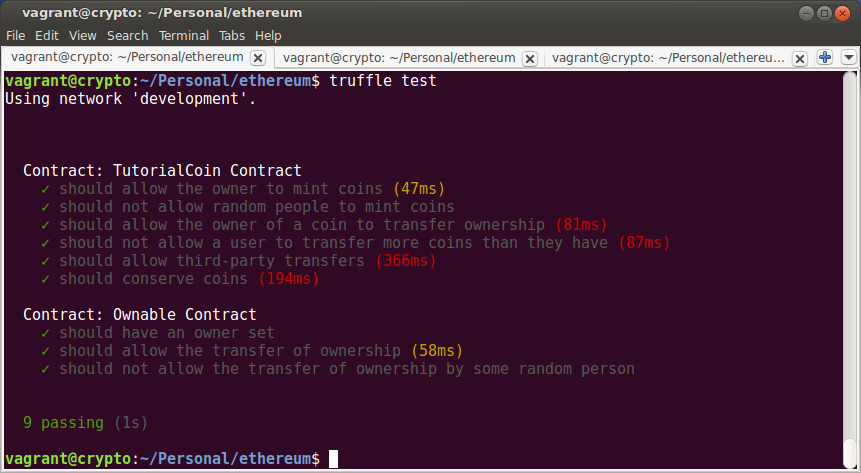

Testing Solidity
================

Testing the Solidity code is a two-step process:

* Bring up the testing network.
* Test with the truffle harness.

The Testing Network
-------------------

If you will recall from `installing the software <../software>`__, one of the node
modules installed is ``testrpc``, which is a local development network. Before you
can test the code, you'll need to have that network up. When it's brought up, it creates
10 test accounts and gives some testing ether to each one. If you bring up the
network in a terminal, you will see output like the following (with the actual addresses
different, as they are randomly generated):

Writing Tests
-------------

Tests can be written in either Solidity or Javascript (information can be
found `here <http://truffleframework.com/docs/>`__). In this tutorial, we have
created two javascript tests (in the ``test`` directory):

* ``erc20_test.js``, which test the ERC20 compliance.
* ``ownership.js``, which tests the ownership functionality.

Additionally, there is a helper file, ``mocks.js``, that provides some useful
functions.

It's beyond the scope of this tutorial to address how tests should be written, but
you can have some flavor of it by looking at the ``ownership.js`` file, which is
fairly short and concise:

.. code:: javascript

  const mock = require('./mocks');

  contract('Ownable Contract', accounts => {

      let campaign;
      let initial = 100;
      before(async () => {
       coin = await mock.deployCoin({initialize: initial});
      });

      it("should have an owner set", async () => {
        // The mock creates the contract from account 0
        let owner = await coin.owner.call();
        assert.equal(owner.valueOf(), accounts[0], "Coins contract should have an owner.");
      });

      it("should allow the transfer of ownership", async () => {
        // The mock creates the contract from account 0
        await coin.transferOwnership(accounts[1])
        let owner = await coin.owner.call();
        assert.equal(owner.valueOf(), accounts[1], "Coins contract should have a new owner.");
      });

      it("should not allow the transfer of ownership by some random person", async () => {
        // The owner is now account 1. Truffle default to account 0 as message sender,
        // but we'll make it explicit anyway
        await mock.expectInvalidOperation(async () => {
             await coin.transferOwnership(accounts[1], {from: accounts[0]});
         });
      });

  });

In this particular suite the mocks file deploys 100 tokens in the ``before`` hook. Then
three tests are conducted of the functionality of the interface.

An astute reader may notice that the tests here (and in the ERC20 suite) are really mostly
testing Open Zeppelin functionality. This is true. Such is the nature of tutorials.

Running the Tests
-----------------

Assuming that ``testrpc`` is up and running, one can run the test suite with
``truffle test``. This will run our test suite, which contains nine tests in the
two files:

If everything worked, we now have a contract ready for deployment.

Next
----

* Using parity to `deploy a contract <../deploy>`__.
